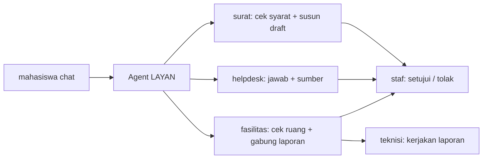
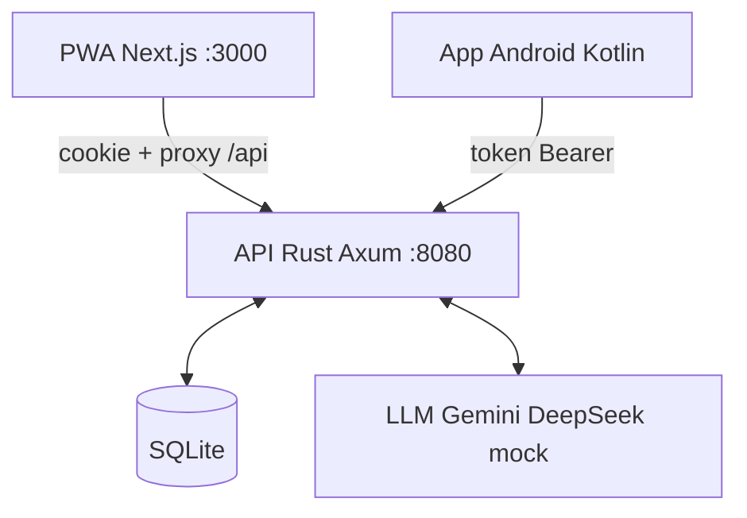

<div align="center">

# LAYAN

**Loket layanan kampus lewat satu chat.**

Mahasiswa menulis apa yang dibutuhkan. Agent AI mengerjakan langkah yang berulang,
staf memutuskan, teknisi memperbaiki.

[](https://layan.codewithus.me)


[Coba langsung](https://layan.codewithus.me) · [Akun demo dan juri](#coba-langsung) · [Rencana dan progres](PLAN.md) · [Kontrak API](docs/API.md) · [Cara kontribusi](CONTRIBUTING.md)

</div>

## Masalahnya

Mengurus surat atau melapor AC bocor di kampus berarti antre di loket, mengisi form yang sama berulang kali,
lalu menunggu tanpa tahu sampai mana prosesnya. Di sisi staf, sebagian besar waktu habis untuk memeriksa hal
yang sama: apakah mahasiswa masih aktif, apakah UKT lunas, apakah lampiran lengkap. Satu surat dispensasi di
loket biasa menyita sekitar 10 sampai 15 menit kerja staf.

LAYAN memindahkan pekerjaan itu ke chat. Agent mengambil profil mahasiswa, memeriksa syarat, dan menyusun draft.
Staf hanya melihat ringkasan dan menekan setuju atau tolak.

## Alur 60 detik



## Tiga worker

| Worker | Yang dikerjakan agent | Yang tetap di manusia |
|---|---|---|
| Surat | Mengambil profil, meminta data dan bukti kegiatan, memeriksa syarat (status aktif, UKT, lampiran), lalu menyusun draft dari template | Staf menyetujui atau menolak. Nomor surat terbit otomatis setelah disetujui |
| Helpdesk | Mencari di Pedoman Akademik dan menjawab dengan sumber. Kalau tidak yakin, agent membuat tiket | Unit terkait membalas tiket |
| Fasilitas | Memeriksa bentrok dan kapasitas ruang, menawarkan jam alternatif, dan menahan slot 24 jam. Laporan kerusakan yang dobel digabung lalu diteruskan ke teknisi | Staf mengonfirmasi booking, teknisi mengerjakan laporan |

Jenis surat yang tersedia ada lima: Surat Dispensasi, Surat Keterangan Aktif Kuliah, Surat Pengantar Magang/KP,
Surat Izin Penelitian/Survei, dan Surat Rekomendasi Beasiswa. Syarat tiap jenis ada di [docs/API.md](docs/API.md).
Laporan kerusakan dikelompokkan ke enam kategori: Listrik, AC, Proyektor, Jaringan, Kebersihan, dan Lainnya.

Agent tidak bisa menyetujui apa pun. Keputusan akhir selalu ada di staf.

## Untuk siapa

| Peran | Apa yang didapat | Halaman |
|---|---|---|
| Mahasiswa | Chat dengan agent untuk minta surat, bertanya soal akademik, memesan ruang, dan melapor kerusakan | `/app` |
| Staf | Antrean permintaan dengan ringkasan agent, hasil cek syarat, lampiran, dan preview surat. Ada tombol setujui, tolak (alasan wajib), dan balas. Halaman metrik menghitung berapa permintaan selesai tanpa staf dan perkiraan waktu yang dihemat | `/staf`, `/staf/metrik` |
| Teknisi | Board empat kolom (Baru, Dikerjakan, Eskalasi, Selesai) dan rekap kerusakan bulanan yang bisa disimpan sebagai PDF atau diunduh sebagai CSV | `/teknisi`, `/teknisi/rekap` |

Setiap aksi agent dan manusia tercatat di audit log. Angka di halaman metrik dihitung dari log itu.
Panduan memakai untuk staf ada di `/untuk-staf` dan untuk teknisi di `/untuk-teknisi`, keduanya bisa dibuka tanpa login.

## Pasang di HP atau laptop

| Platform | Cara |
|---|---|
| Android | Unduh APK di `/api/app/layan.apk` (khusus mahasiswa), atau pasang PWA lewat Chrome |
| iPhone dan iPad | Buka di Safari, ketuk Bagikan, lalu Tambah ke Layar Utama |
| Windows, macOS, Linux | Pasang PWA lewat Chrome atau Edge dari ikon instal di kolom alamat |

Petunjuk lengkap ada di [`/unduh`](https://layan.codewithus.me/unduh).

Yang belum ada: app iOS, rilis di App Store atau Play Store, installer desktop (.exe, .dmg, .deb), notifikasi
push, SSO, dan sinkronisasi offline.

## Arsitektur



```
api/       Rust (Axum + SQLx + SQLite): auth, data, agent loop + tools, SSE
web/       Next.js: landing page (/), PWA (/app mahasiswa, /staf Staff Console, /teknisi Board)
android/   Kotlin + Jetpack Compose: App Android (mahasiswa saja)
docs/      Kontrak API (docs/API.md)
deploy/    systemd unit + skrip deploy ke home server (Cloudflare Tunnel)
```

PWA dan App Android adalah dua produk terpisah yang memakai API yang sama.

Agent memakai LLM berformat chat completions (Gemini, DeepSeek, dan sejenisnya). Tanpa API key, agent tiruan
berbasis aturan mengambil alih. Agent tiruan ini juga jadi cadangan kalau LLM error atau tidak merespons,
jadi layanan tetap jalan.

## Coba langsung

Buka [layan.codewithus.me/login](https://layan.codewithus.me/login), lalu masuk dengan salah satu akun di bawah.

Akun demo (password = `SEED_PASSWORD` di `api/.env`):

| Peran | NIM / Email | Halaman |
|---|---|---|
| Mahasiswa | `245150200111001` / `raka@mhs.layan.test` | /app |
| Mahasiswa | `nadia@mhs.layan.test` | /app |
| Staf | `sari@staf.layan.test` | /staf |
| Teknisi | `joko@staf.layan.test` | /teknisi |

Akun juri (server demo). Setiap juri memakai satu set: mahasiswa, staf, dan teknisi.
Password dibagikan terpisah ke masing-masing juri dan tidak disimpan di repo publik ini.

| | Mahasiswa (/app) | Staf (/staf) | Teknisi (/teknisi) |
|---|---|---|---|
| Juri 1 | `juri1-mhs-hzccc@layan.test` | `juri1-staf-62jzg@layan.test` | `juri1-tek-r75p4@layan.test` |
| Juri 2 | `juri2-mhs-atxet@layan.test` | `juri2-staf-v6vy7@layan.test` | `juri2-tek-x6x6j@layan.test` |
| Juri 3 | `juri3-mhs-yustr@layan.test` | `juri3-staf-x5k5s@layan.test` | `juri3-tek-nh54f@layan.test` |

Urutan yang disarankan untuk melihat seluruh alur: masuk sebagai mahasiswa dan minta surat lewat chat, buka
akun staf untuk menyetujuinya, lalu laporkan kerusakan ruang dan kerjakan laporannya dari akun teknisi.
Skrip demo lengkap ada di [DEMO.md](DEMO.md).

<details>
<summary>Dari mana akun-akun ini berasal?</summary>

Seed (`api/src/seed.rs`) mengisi tabel `users` hanya saat masih kosong.
Kalau file `accounts.json` ada di folder `api/` (di-gitignore, jangan di-commit),
akun diambil dari file itu. Kalau tidak ada, akun demo dibuat dengan satu
`SEED_PASSWORD`. Contoh format ada di `api/accounts.example.json`. Daftar lengkap
beserta password juri dan langkah pasang di server ada di `api/AKUN-juri.md`
(hanya lokal, tidak di-commit).

</details>

## Jalankan lokal

```bash
cd api && cp .env.example .env && cargo run            # API :8080, akun demo dibuat otomatis
npm --prefix web install && npm --prefix web run dev   # PWA :3000, /api diteruskan ke Rust
```

<details>
<summary>Catatan Windows</summary>

- Rust butuh linker C. Pasang MSVC Build Tools, atau toolchain GNU + MinGW
  (`winget install BrechtSanders.WinLibs.POSIX.MSVCRT`).
- `reqwest` memakai TLS `rustls`/`aws-lc-sys` yang berat di Windows GNU.
  Untuk dev lokal boleh sementara pakai `native-tls`, tetapi jangan di-commit.

</details>

<details>
<summary>Android</summary>

Buka folder `android/` di Android Studio, atau jalankan:

```bash
cd android && ./gradlew assembleDebug
```

APK ada di `android/app/build/outputs/apk/debug/`. Alamat API diatur di
`android/gradle.properties` (`layan.apiBase`).

</details>

## Berkontribusi

Baca [CONTRIBUTING.md](CONTRIBUTING.md) untuk alur branch dan PR, dan [docs/API.md](docs/API.md) sebelum
menambah endpoint. Warna, font, dan komponen web mengikuti design system yang bisa dilihat di `/design-system`.

## Tim

| Peran | Nama |
|---|---|
| Team Lead, Full Stack Developer | ARVA MADA JAYASTU |
| Front End Developer | FRISTIAN BOAS NATHANIEL |
| Front End Developer | FARREL ARZAQIA MECCA |

Isi Pedoman Akademik di knowledge base hanyalah contoh dan bukan dokumen resmi.
