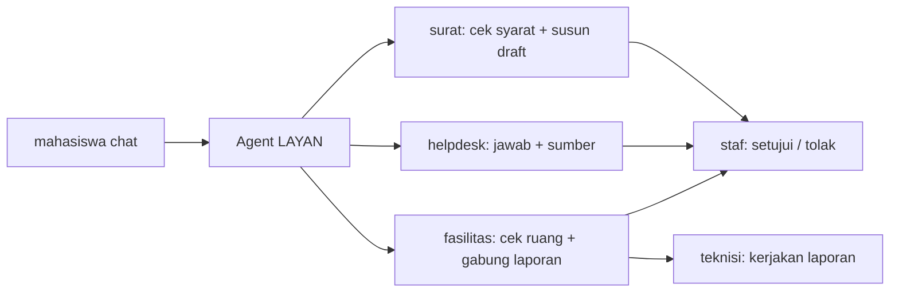
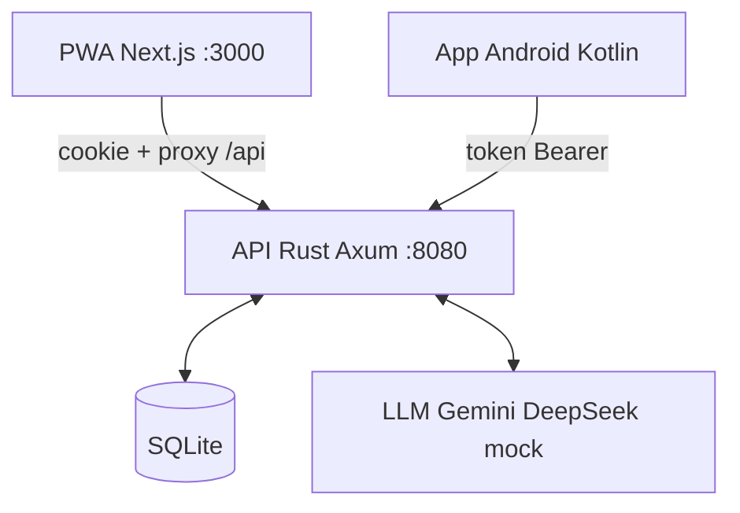

# LAYAN

> Loket layanan kampus lewat satu chat. Mahasiswa meminta, agent AI mengerjakan
> yang repetitif, staf memutuskan, teknisi mengeksekusi.

[](https://layan.codewithus.me)


- 🚀 Coba langsung: https://layan.codewithus.me (akun di bawah)
- 🗺️ Rencana & progres: [PLAN.md](PLAN.md) · Kontrak API: [docs/API.md](docs/API.md) · Cara kontribusi: [CONTRIBUTING.md](CONTRIBUTING.md)

## Daftar isi

- [Alur 60 detik](#alur-60-detik)
- [Tiga worker](#tiga-worker)
- [Arsitektur](#arsitektur)
- [Coba langsung (akun demo & juri)](#coba-langsung-akun-demo--juri)
- [Jalankan lokal](#jalankan-lokal)
- [Tim](#tim)

## Alur 60 detik



## Tiga worker

| Worker | Yang dikerjakan agent | Yang tetap di manusia |
|---|---|---|
| **Surat** | ambil profil, minta data dan bukti kegiatan, cek syarat (status aktif, UKT, lampiran), susun draft dari template | staf approve/reject, nomor surat terbit otomatis |
| **Helpdesk** | cari di Pedoman Akademik, jawab dengan sumber, buat tiket kalau tidak yakin | unit membalas tiket |
| **Fasilitas** | cek bentrok dan kapasitas ruang, tawarkan jam alternatif, tahan 24 jam; laporan kerusakan dobel digabung dan langsung ke teknisi | staf konfirmasi booking, teknisi mengerjakan laporan |

Setiap aksi agent dan manusia tercatat di audit log. Dari situ Staff Console menghitung
berapa permintaan selesai tanpa staf dan perkiraan waktu staf yang dihemat.

Agent memakai LLM format chat completions (Gemini, DeepSeek, dll). Tanpa API key, agent
tiruan berbasis aturan mengambil alih, dan juga jadi cadangan kalau LLM error atau diam.

## Arsitektur



```
api/       Rust (Axum + SQLx + SQLite): auth, data, agent loop + tools, SSE
web/       Next.js: landing page (/), PWA (/app mahasiswa, /staf Staff Console, /teknisi Board)
android/   Kotlin + Jetpack Compose: App Android (mahasiswa saja)
docs/      Kontrak API (docs/API.md)
deploy/    systemd unit + skrip deploy ke home server (Cloudflare Tunnel)
```

PWA dan App Android adalah dua produk terpisah yang berbagi API yang sama.

## Coba langsung (akun demo & juri)

Login di `/login` (server demo: https://layan.codewithus.me/login).

Akun demo (password = `SEED_PASSWORD` di `api/.env`):

| Peran | NIM / Email | Halaman |
|---|---|---|
| Mahasiswa | `245150200111001` / `raka@mhs.layan.test` | /app |
| Mahasiswa | `nadia@mhs.layan.test` | /app |
| Staf | `sari@staf.layan.test` | /staf |
| Teknisi | `joko@staf.layan.test` | /teknisi |

Akun juri (server demo). Setiap juri memakai satu set (mahasiswa, staf, teknisi).
Password dibagikan terpisah ke masing-masing juri, tidak disimpan di repo publik ini.

| | Mahasiswa (/app) | Staf (/staf) | Teknisi (/teknisi) |
|---|---|---|---|
| Juri 1 | `juri1-mhs-hzccc@layan.test` | `juri1-staf-62jzg@layan.test` | `juri1-tek-r75p4@layan.test` |
| Juri 2 | `juri2-mhs-atxet@layan.test` | `juri2-staf-v6vy7@layan.test` | `juri2-tek-x6x6j@layan.test` |
| Juri 3 | `juri3-mhs-yustr@layan.test` | `juri3-staf-x5k5s@layan.test` | `juri3-tek-nh54f@layan.test` |

<details>
<summary><b>Dari mana akun-akun ini berasal?</b></summary>

Seed (`api/src/seed.rs`) mengisi tabel `users` hanya saat masih kosong.
Kalau file `accounts.json` ada di folder `api/` (di-gitignore, jangan commit),
akun diambil dari file itu; kalau tidak ada, akun demo dibuat dengan satu
`SEED_PASSWORD`. Contoh format: `api/accounts.example.json`. Daftar lengkap
beserta password juri dan langkah pasang di server ada di `api/AKUN-juri.md`
(lokal saja, tidak di-commit).

</details>

## Jalankan lokal

```bash
cd api && cp .env.example .env && cargo run            # API :8080, akun demo dibuat otomatis
npm --prefix web install && npm --prefix web run dev   # PWA :3000, /api diteruskan ke Rust
```

<details>
<summary><b>Catatan Windows</b></summary>

- Rust butuh linker C: pasang MSVC Build Tools, atau toolchain GNU + MinGW
  (`winget install BrechtSanders.WinLibs.POSIX.MSVCRT`).
- `reqwest` memakai TLS `rustls`/`aws-lc-sys` yang berat di Windows GNU;
  untuk dev lokal boleh sementara pakai `native-tls`, jangan commit perubahan itu.

</details>

<details>
<summary><b>Android</b></summary>

Buka folder `android/` di Android Studio, atau:

```bash
cd android && ./gradlew assembleDebug
```

APK ada di `android/app/build/outputs/apk/debug/`. Alamat API diatur di
`android/gradle.properties` (`layan.apiBase`).

</details>

## Tim

| Area | Pemilik |
|---|---|
| `api/`, `android/`, `deploy/`, `docs/`, `PLAN.md`, `DEMO.md` | Arva (backend + Android) |
| PWA mahasiswa | FE-1 |
| Landing, Staff Console, Board Teknisi | FE-2 / Boas |

Aturan main dan alur branch/PR: [CONTRIBUTING.md](CONTRIBUTING.md).
Tugas per orang dilacak di GitHub Issues (label `boas` / `arqia` / `api`).

Isi Pedoman Akademik di knowledge base adalah contoh, bukan dokumen resmi.
